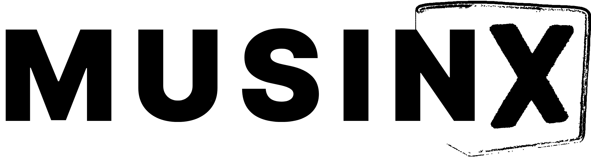

---
A public domain microkernel.

Currently designed for RISC-V, architecture asbtraction planned.

## Requirements

- qemu
- qemu-extra
- make
- clang
- probably other stuff too... idk

## Build / Boot

To build:
```
make 
```

To boot:
```
make qemu
```
Exit QEMU by pressing Ctrl+A then X.

To clean:
```
make clean
```